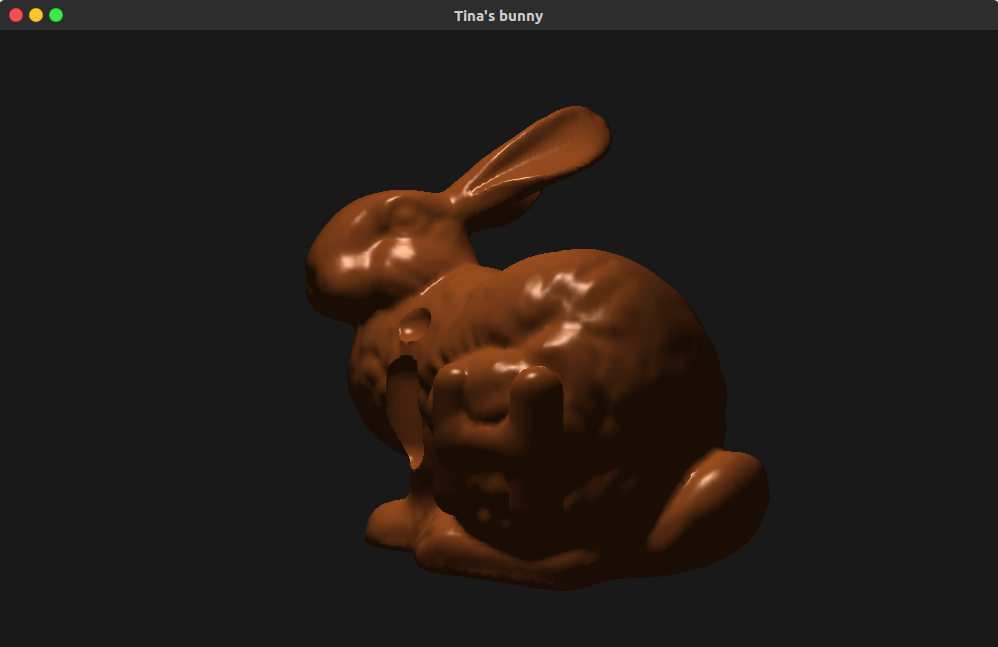
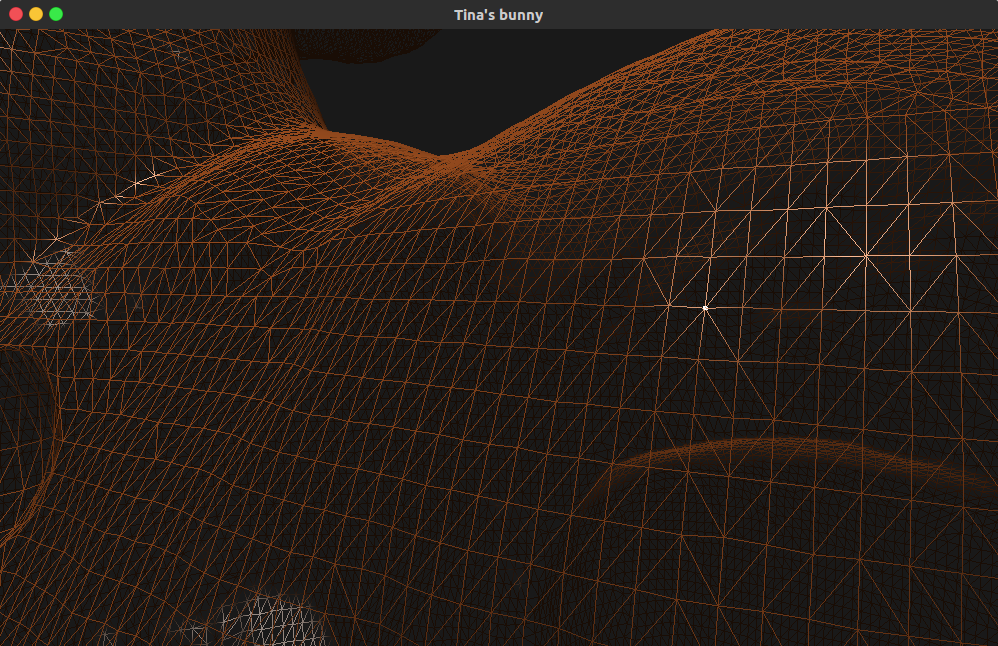
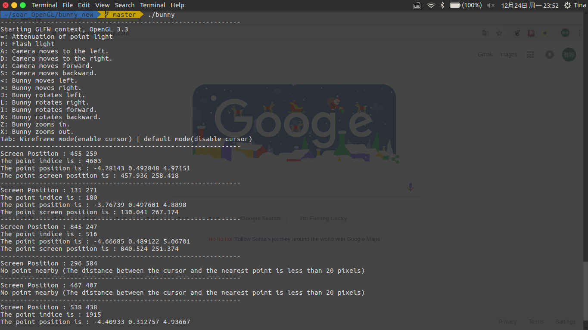

# Bunny_OpenGL
[](https://en.wikipedia.org/wiki/C++)     [](https://github.com/Tina-princess/Bunny_OpenGL)  
Stanford's Bunny written in OpenGL  


实验的原始数据为斯坦福大学的Bunny ([./bunny_new/bunny_iH.ply2](bunny_new/bunny_iH.ply2))  
兔子项目的全部代码在[./bunny_new](bunny_new)文件夹下  
其他文件夹里为我看教程学习OpenGL的源码，同样为编译通过的完整工程，供读者参考


----------
English version

The original data of the experiment is the Bunny data from Stanford University ([./bunny_new/bunny_iH.ply2](bunny_new/bunny_iH.ply2))  
The codes for Bunny are in the [./bunny_new] (bunny_new) folder.  
In other folders, there are the source code I collected when I learned OpenGL with the tutorial (mentioned later). They are also complete projects compiled successfully. Post for readers' reference.

----------


## Requirements
* [glfw 3.2.1](https://www.glfw.org/)
* [glew](https://www.glfw.org/) or [glad](https://glad.dav1d.de/)
* [SOIL](http://www.lonesock.net/soil.html) or [stb_image.h](https://github.com/nothings/stb/blob/master/stb_image.h)
*  [glm](https://glm.g-truc.net/0.9.8/index.html)

*（Note: The header files mentioned above can be found under ./Include)*  
  
## How to use my code
run the `memo.sh` under ./Bunny_new
```bash
$ bash memo.sh
```
## Result



## Acknowledgement & Recommendation
[OpenGL Chinese Tutorial (new)](https://learnopengl-cn.github.io/)  
Corresponding to all folders with "_new" suffix under this repository  

[OpenGL Chinese Tutorial](https://learnopengl-cn.readthedocs.io/zh/latest/)  
Corresponding to all folders without "_new" suffix under this repository  

[Mr.Yuan's Github bunny](https://github.com/HarborYuan/bunny/)  
Thanks for Mr.Yuan's generous guidance, I borrowed some of his ideas.  

## LICENSE
[MIT LICENSE](LICENSE)
